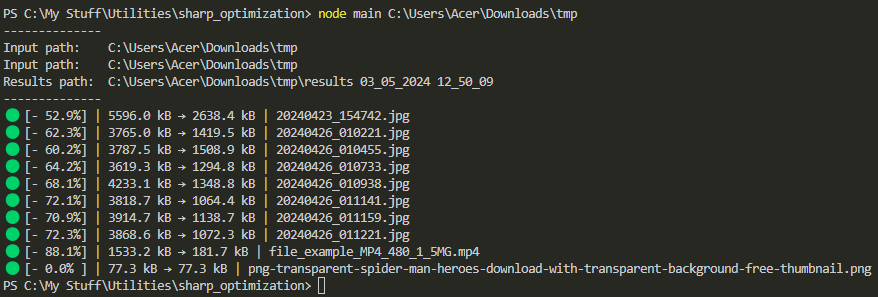

<h1 align="center">Photo and Video Size Reducer</h1>
<p align="center">
  <strong>
  Reduces the size of photos and videos in a specified folder
    </strong>
</p>
<p align="center">
  Made with <code>JavaScript</code>, <code>NodeJS</code>
</p>

<p align="center">
  <a href="../../commits"></a>
  <a href="./LICENSE"></a>
  
</p>

<p align="center">
  <a href="#ℹ%EF%B8%8F-about">ℹ️ About</a> • 
  <a href="#%EF%B8%8F-tools">⚙️ Tools</a> • 
  <a href="#-build-project">🔨 How to Build Project</a> • 
  <a href="#-file-structure">📁 File Structure</a>
</p>

<sup>
  <p align="center">
    <a href="#-screenshots">🖼 Screenshots</a> • 
    <a href="#-npm-packages-worth-mentioning">📦 NPM Packages worth mentioning</a> • 
    <a href="#-details">💡 Details</a> • 
    <a href="#-useful-resources">🔗 Useful resources</a> • 
    <a href="#-author">👤 Author</a>
  </p>
</sup>

## 🖼 Screenshots

<p align="center">
  
</p>

## ℹ️ About

From time to time I need to empty the storage of my smartphone. For that purpose I move photos and videos to my computer. To optimize the storage of all those photos and videos I reduce their size.

Earlier the process was manual and relied on online services like Squoosh (didn't even optimize the size of videos because it was too cumbersome).

Then a sudden thought struck my mind: why not try to automate that process. It's not that difficult to do the process manually if there are only several photos. Although desire for optimization arises when there are hundreds of them.

Thus this is the goal of the project: to automate the size reduction of photos and videos!

I made it purely for myself... So as long as it works for me, it's perfectly fine.

## ⚙️ Tools

- **JavsScript**
- **NodeJS**

## 🔨 Build project

<table>
  <tr>
    <th>Command</th>
    <th>Description</th>
  </tr>
  <tr>
    <td><code>npm&nbsp;i</code></td>
    <td>First things first, install all required packages</td>
  </tr>
  <tr>
    <td><code>node&nbsp;main&nbsp;name_of_the_directory</code></td>
    <td>Optimize the photos and videos inside of the specified folder. A new folder will be created. It will contain the optimized photos and videos</td>
  </tr>
  <tr>
    <td><code>node&nbsp;main</code></td>
    <td>Do the same what the previous command does, but this time the path to the folder will be taken from .env variable/td>
  </tr>
</table>

## 📁 File Structure

```Markdown
├── 📁 screenshots            Screenshots
├── 📝 .env.example           Example of an .env file (create your own .env !)
├── 📝 .gitignore             Instructions for Git about what files to ignore
├── 📝 LICENSE                MIT License. Basically you can do whatever you want with the code
├── 📝 main.js                The heart, the soul, and the core of this project
├── 📝 package-lock.json      Keeps track of the exact version of every package that is installed
├── 📝 package.json           Various metadata relevant to the project, scripts, dependencies
└── 📝 README.md              Project description
```

## 📦 NPM Packages worth mentioning

<table>
  <tr>
    <td><code>sharp</code></td>
    <td>Optimizes images</td>
  </tr>
  <tr>
    <td><code>fluent-ffmpeg</code></td>
    <td>Optimizes videos</td>
  </tr>
</table>

## 💡 Details

It took more time than expected. Starting to get used to that

### A timer

Had to add a timer before accessing size of a newly created file. Otherwise NodeJS would return an error for some reason even though the attempt of accessing happened synchronously after the creation of the file... Had to increase that timer because otherwise NodeJS showed incorrect data for the reduces videos... Have no idea why that happened

### `continue`, not `return`

Spent 1 hour in order to find out that you should use `continue` instead of `return` in `for` loop... It is what it is, true and real.

### About not moving utility functions

The code is only about 130 lines of code, so I don't see any point in moving utility functions in a separate file.

### Limitations

The program optimizes only .jpg, .png, .jpeg, .mp4. It suffices all my needs. When necessary I might add more extensions.

## 🔗 Useful resources

n/a

## 👤 Author

- Frontend Mentor - [@GrbnvAlex](https://www.frontendmentor.io/profile/GrbnvAlex)
- Telegram - [@Arlagonix](https://t.me/arlagonix)
- Github - [@arlagonix](https://github.com/arlagonix)
